**Last Updated: 2022-04-01 10:45**

*[AOM]: Account Operations Manager
*[BAU]: Business As Usual
*[BB]: Billing Block
*[BoM]: Bill of Material
*[C&C]: Credit and Collection
*[CBN]: Customer Base Number
*[CM ]: Client Manager
*[CEP]: Contract Evaluation Package
*[CMO]: Contract Management Operations
*[CMS]: Customer Master Sheet
*[CoA]: Certificate of Acceptance
*[CO]: Change Order
*[COS]: Customer Operations Specialist
*[COSD]: Change Order Service Desk
*[CPA]: Country Participation Agreement
*[CSM]: Client Service Manager
*[CSSA]: Contract ID
*[DCC]: Device Control Centre
*[DOA]: Dead on Arrival
*[DOS]: Deal Output Sheet
*[dMPS]: Direct Managed Print Service
*[dTC]: Delivery Technical Consultant
*[EOL]: End of life
*[FIS]: Fleet Implementation Sheet
*[FOCA]: Front Office Contract Administrator
*[GSOW]: Global Statement of Work
*[GTC]: Global Trade Checklist
*[HP-ADM]: Hewlett Packard – Account Delivery Manager
*[HPAC]: HP Access Control
*[HP-GP]: Hewlett Packard – Global Procurement
*[HP-PM]: Hewlett Packard – Project Manager
*[HP-TC]: Hewlett Packard – Technical Consultant
*[H&S]: Health and Safety
*[HW]: Hardware
*[ICM]: Integrated Contract Management
*[LSOW]: Local Statement of Work
*[MAI]: Manage As Is
*[MIS]: Management Information System
*[MPS]: Managed Print Service
*[MS]: Managed Services
*[MSA]: Master Services Agreement
*[MSS]: Managed Supplies Service
*[NPS]: Non-Proliferation
*[OC]: Office Communicator
*[OPG]: Order Processing Guide Line
*[OA]: Order Acceptance
*[OAC]: Order Acceptance Checklist
*[OSA]: On-Site Administrator
*[PAT]: Portable Appliance Testing
*[PM]: Project or Programme Manager
*[P&L]: Profit and Loss
*[PN]: Product Number
*[PPS]: Personal Printing Systems
*[PPU]: Pay per Use
*[PO]: Purchase Order
*[POC]: Proof of Concept
*[RA]: Risk Assessment
*[RAMS]: Risk Assessment Method Statement
*[RM]: Remote Monitoring
*[RMA]: Remote Monitoring Appliance
*[RPL]: Restricted Parties List
*[RRC]: Revenue Recognition Checklist
*[RTM]: Route to Market
*[SAL]: Shipping Authorization Letter
*[SAID]: ???
*[SCID]: Sales contract ID
*[SDM]: Service Delivery Manager
*[SLA]: Service Level Agreement
*[SOW]: Statement of Work
*[SSOW]: Site Statement of Work
*[SC CO]: Supply Chain Customer Operations
*[SCOAH]: Supply Chain Operations and Analytics Hub (back office team)
*[SOTAT]: Sales Order Turn Around Time
*[SW]: Software
*[TAT]: Turn Around Time
*[T&C’s]: Terms & Conditions
*[TC]: Technical Consultant
*[TCV]: Total Contractual Value
*[TL]: Team Lead
*[TM]: Transition Manager
*[TPM]: Transition Project Manager
*[T&T]: Transition and Transformation
*[VAS]: Value Added Service
*[VAL]: Vendor Authorisation Letter
*[WO]: Work Order

# E2E dMPS Process

A dMPS project is broadly divided into following phases:
* [Pursuit Handover](#pursuit-handover)
* [Kickoff](#kickoff)
* [Planning](#planning)
* [Ordering](#ordering)
* [Deployment Preparation](#deployment-preparation)
* [Deployment](#deployment)
  - [Hardware Deployment](#hardware-deployment)
  - [Software Deployment](#software-deployment)
* [Lease Activation](#lease-activation)
* [BAU Handover](#bau-handover)

In addition there are sub processes that may get triggered from time to time:

* [Dead on Arrival Process](#doa-process)
* [Change Order Process](#change-order-process)
* [New Vendor Setup in Procure 360](#new-vendor-setup-in-procure-360)

These sub processes are referenced in main processes as well.

## Pursuit Handover

For any dMPS deal the very first step is with pursuit team to get a signed contract but before the deal is handed over to delivery there are certain steps that must be in place and T&T TM must ensure that these steps have been completed or an exception has been agreed and signed-off by Market T&T TL.

!!! tip Some Key topics for discussion during handover

    * Purchase Order (PO is now mandatory – unless email received from customer confirming a PO is not required for invoice to be paid) or, approval is obtained from T&T TL to proceed without a PO.  This should be obtained from Sales/Pursuit and provided to PM during Handover
    * 3rd parties
    * MIS solutions (BoM – to be bought or leased)
    * Confirm if Legacy devices are being removed
    * Hard disk wipe – for legacy devices
    * SLA of the project – check the value of the SAL covers the project (compared to DOS files)
    * Coterminous/non coterminous
    * Penalties
    * Maintenance kit support
    * Non standard HW ordering from HP partner
    * MAI devices
    * OSA’s
    * Check End of Support Life & EOL dates for the devices in scope
    * Case Exchange
    * RMC involvement, confirmed process outlined and how we are engaging with them
    * RMMC name is documented by the Pursuit Team

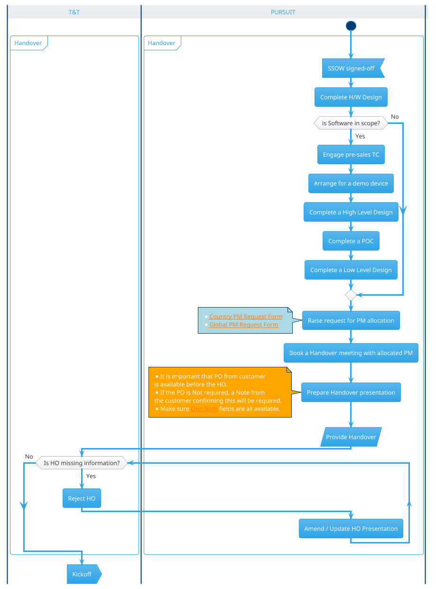

!!! caution If software is in scope...
    Solutions are component parts of an MPS deal which are in addition to print devices.  They can include management tools such as WebJet Admin (WJA) and Digital Send Software (DSS) or pull print hard/software supplied by companies such as LRS, Papercut etc.  

    Deals which include a _Solution_ should:

    * Have a POC during the sales cycle to show the solution and how it may work in principal in the customer environment, typically a test environment.
    * Have a pilot either during the sales cycle or during transition to test and prove the actual solution design performs as expected in a live customer environment prior to full deployment across the estate.

## Kickoff

!!! tip Some topics to cover with the customer during kick-off:
    * Delivery Process
    * Delivery Access
    * Engineer clearance
    * H&S requirements including induction
    * Names/Vehicle Reg – required in advance
    * Escort required
    * RAMS required
    * Label Template
    * Supplies contact for each site/device

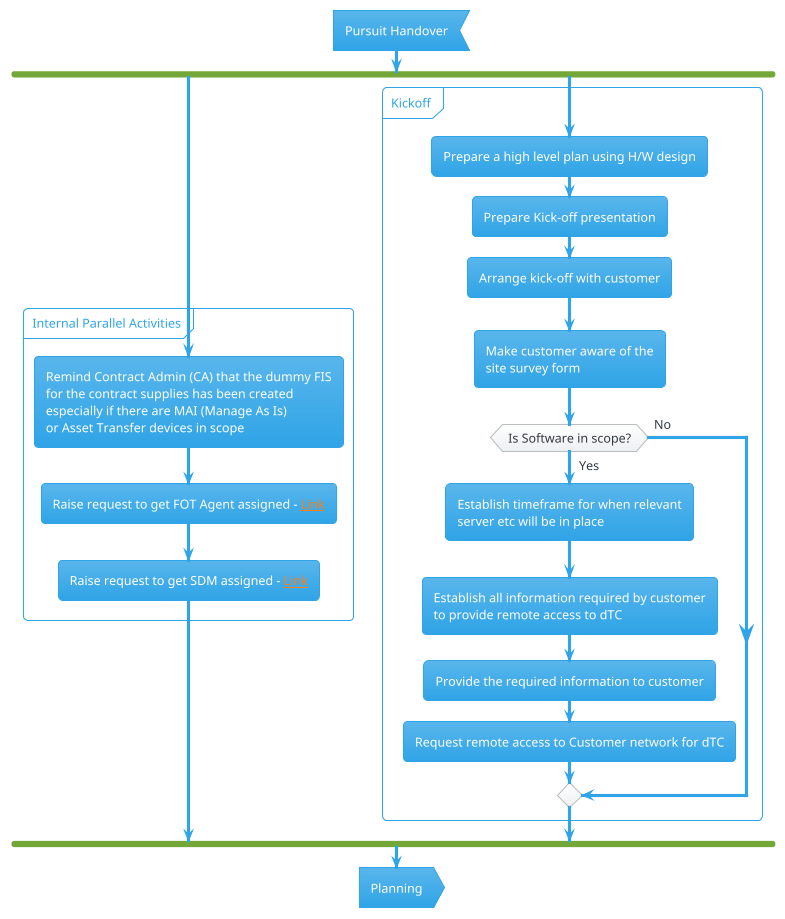
## Planning

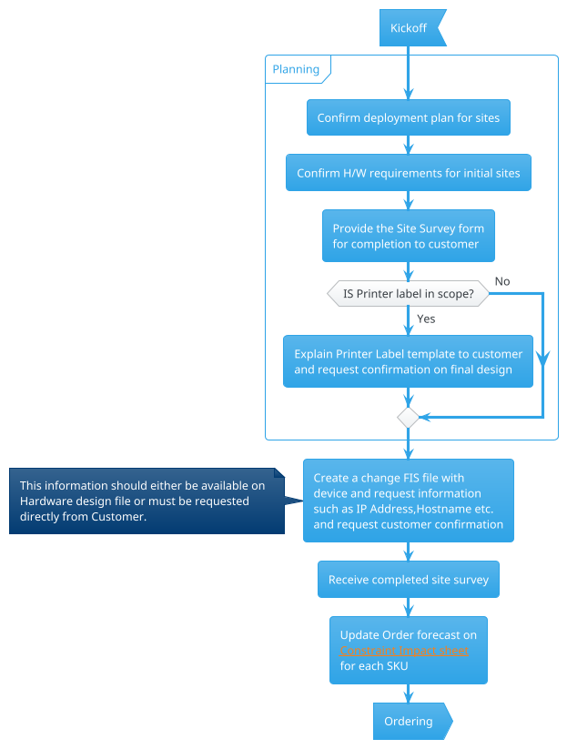

## Ordering

### Hardware Ordering

Hardware ordering has a financial impact on HP and needs to be planned carefully to ensure HP is able to release the invoice and recognize revenue as quickly as possible, and minimize storage costs.

!!! tip
    This means some projects will require multiple hardware orders which reflect the detailed deployment schedule/device roll out.

    * ex.  A deployment of 1 site with 50 devices and no solution may take a week to deploy.  In this case one hardware order would be sufficient
    * ex.  A deployment of 5 large sites, with 250 devices per site and a pull print solution could take 15 weeks or more to deploy.  In this case at least 5 hardware orders should be considered.  Once all the devices on a hardware order are deployed and accepted by the customer, the invoice must be released, by requesting the removal of the Billing Block and HP can start to recognize the revenue.

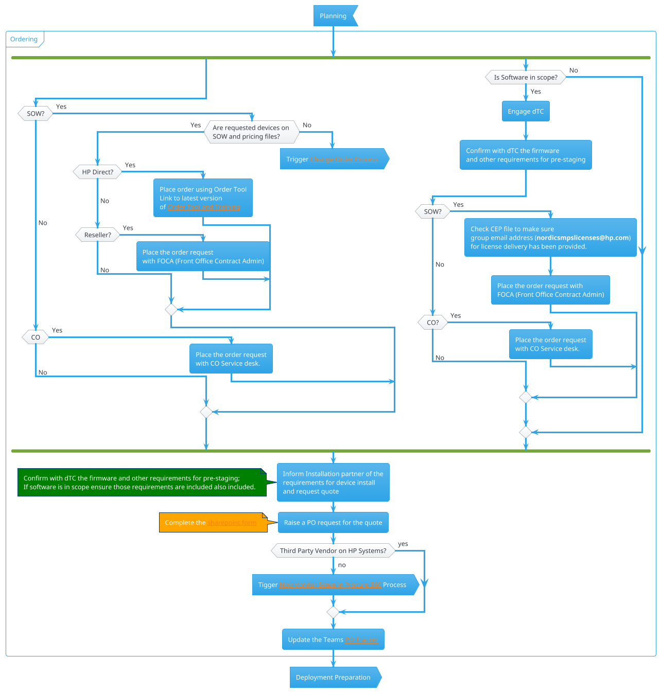

### Software Ordering

For solution orders the PM should reach out to the CA directly with the details on what needs to be ordered and the respective DS link with all the documentation. CA should raise a ticket and provide you a link to the ticket whete you can trace the progress of order placement and where eventually a tracking number will appear (if applicable).

So long as all the pricing and documentation is in place and correct, then the order should go through fine – in case of any issues work with the CA.

Solution hardware is tracked through SOS team – request an update from the SOS Team – ipg.solutions.sos@hp.com

Solution license keys requested - Request SOS Team & Global Procurement to cc PM when they provide the license keys from the Smartbuy PO to SP to the customer.

Technical meeting - review high throughput devices. Identify very high-volume devices which could run out of toner before they are active in remote monitoring - the factory cartridges are standard not the high yield, e.g. M4555 CE390A standard cartridge is 10K, CE390X is 24K. DO NOT order buffer stock as for BASE+CLICK contracts, any advance toners will be at HP's cost unless the customer agrees to pay through a Change Order.  You can place a buffer order if you are Level Pay, with approval.

Once the first solution is deployed you will receive a SAID number for the solution – this is required for placing break/fix requests for solution issues. This needs to be passed onto the SDM during handover to BAU.

## Deployment Preparation

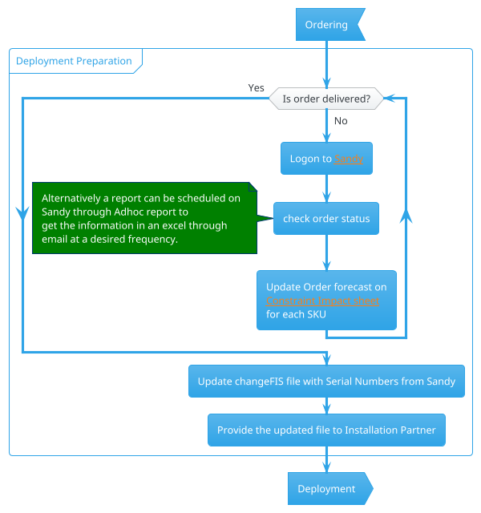
## Deployment

### Hardware Deployment

!!! note What exactly is Staging?
    **“Staging”** is the process of unpacking the printers, testing them and pre-configuring them prior to final delivery to the customer site.  Details of what is to be included in staging should be passed to the partner by the PM through the completion of an Installation and Delivery (I&D) Guide and Work Instructions. The assigned HP Technical Consultant (TC) should assist in defining the default device configuration to be applied to the devices with the customer.

    !!! Info
        Where there is a solution, staging by the installation partner is mandatory.

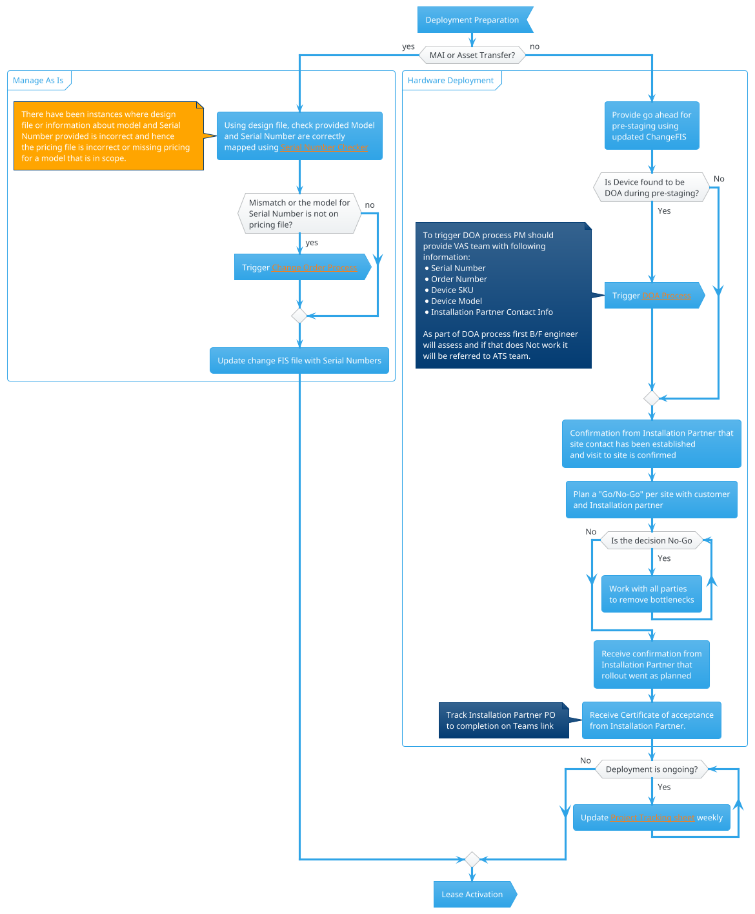

### Software Deployment

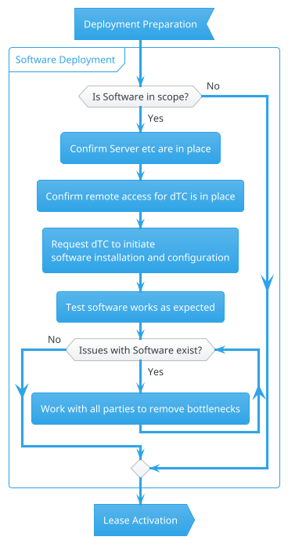

## Lease Activation

!!! note What is Billing Block?
    Billing Block is a flag on ordering system which stops an invoice from being sent out to customer as soon as devices have been shipped.

    All hardware must be shipped with a _**billing block**_ that should not be removed until all devices on that order have been deployed.

    !!! tip If there are multiple hardware orders for any one customer, it is advisable to use the devices from one complete order before moving onto the next order where possible, in order to be able to release the hardware order for billing.

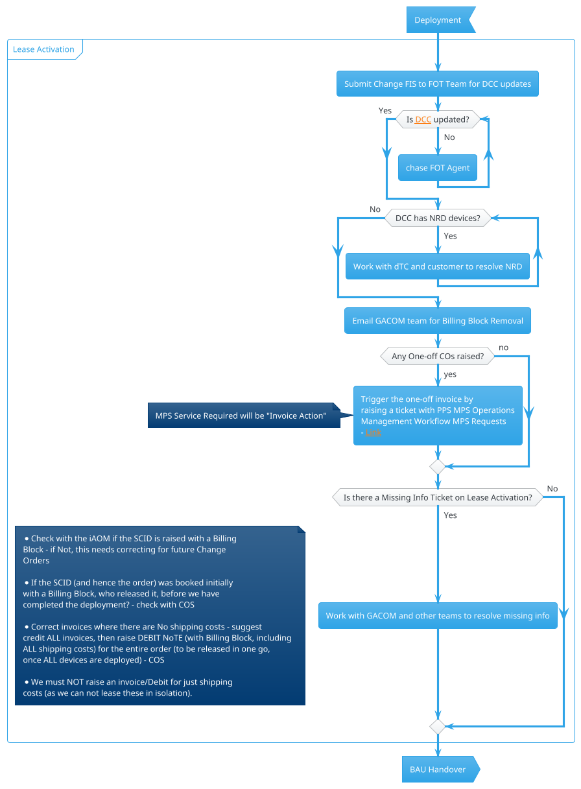

## BAU Handover

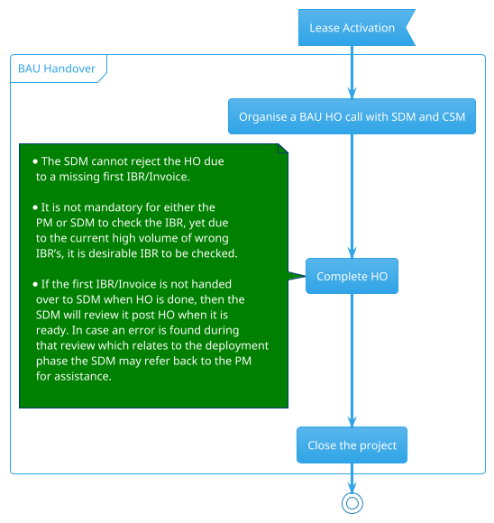
# DOA Process

!!! note What is a DOA device?
    A DOA (dead on arrival) device is one that fails within 30 days of installation and cannot be repaired (devices are expected to have been installed within 90 days of ordering).

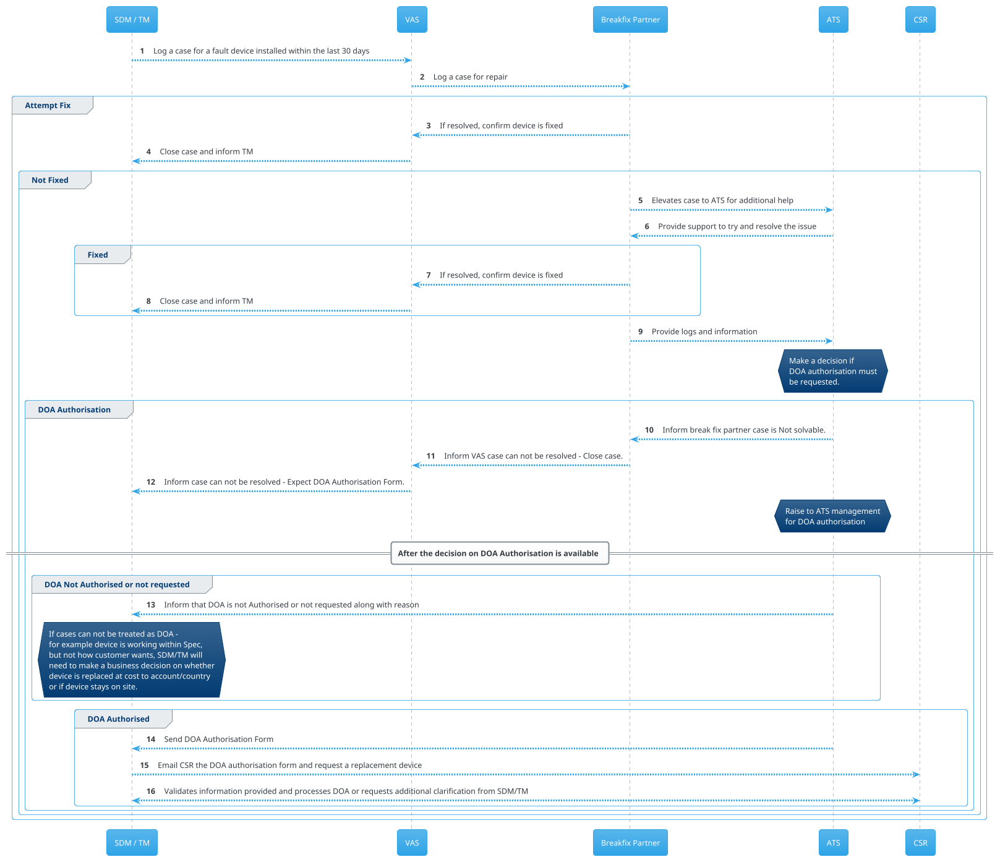
<!--
## DOA Process Swim Lane

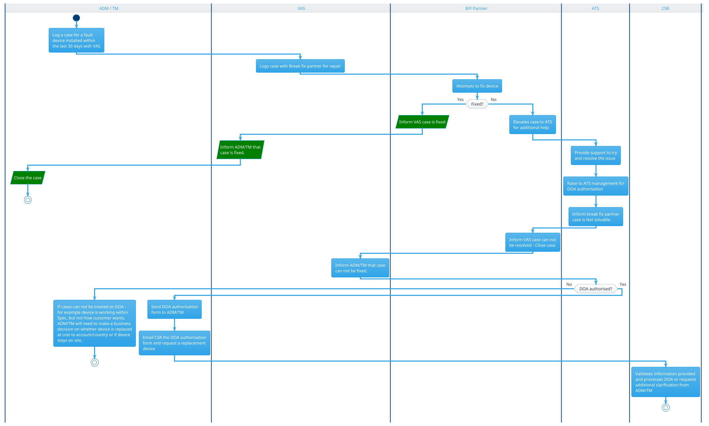
-->

# Change Order process

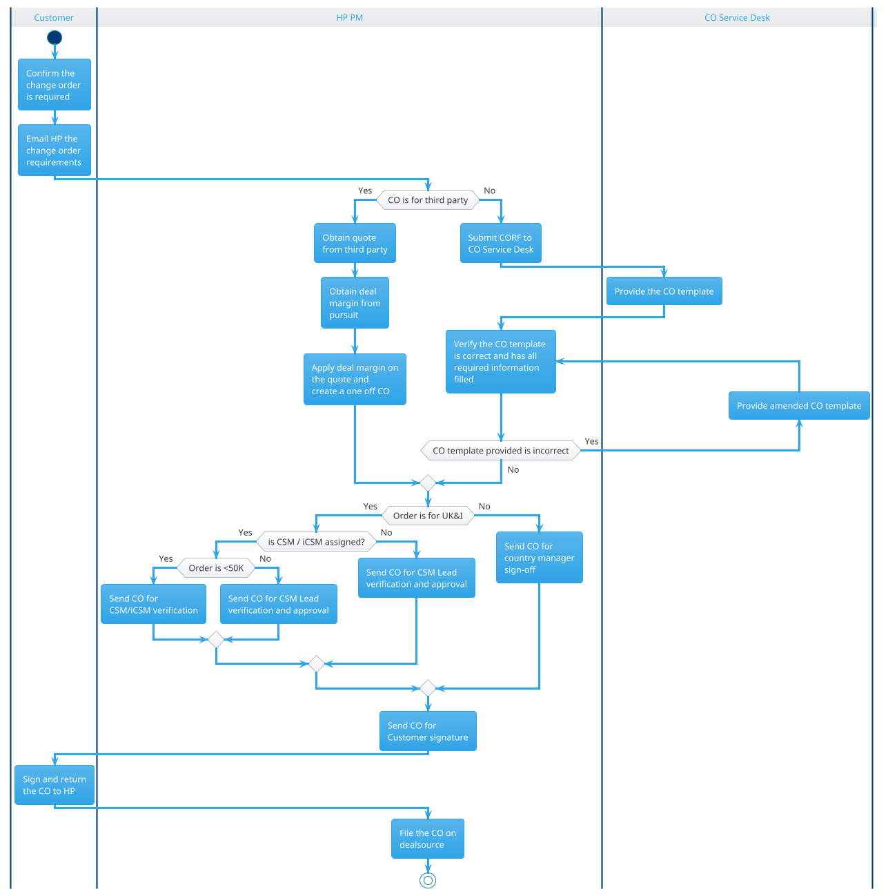

# New Vendor Setup in Procure 360

While not regularly required, there are times when a deal includes service / component that is to be procured from a third party. If the third party is set-up on HP system it usually is fairly straight forward process to raise the order through Sharepoint Workflow.

However, if the vendor is not on HP system specifically for the country where the services are required, this will require setting up the vendor on HP system. At this point, PM will need to facilitate the following information on the vendor. Most of it should be on the quote from vendor but where missing it should be possible to request directly from vendor:

!!! note Please note it is mandatory to fill the below template to create the New vendor in Procure 360.
    ||Response|
    |--|--|
    |Supplier legal name:||
    |Address(Street):||
    |City:||
    |Postal Code:|
    |Country:||
    |State:||
    |Region:||
    |Email address:||
    |Phone:||
    |Supplier Contact First Name:||
    |Supplier Contact Last Name:||
    |Currency:||
    |Region and Country where services would be delivered:||
    |What will be the services/deliverables that the Supplier will provide?:||
    |Is this a non-US based supplier providing services within the US? :| Yes or No|
    |Is there a conflict of interest between you and/or the party you are requesting on behalf of, and the supplier?:| Yes or No|
    |Will this supplier provide products and/or services to the public sector?:|Yes or No|
    |Will the supplier have access to HP employee and/or HP customer personal data?:  <code>Personal data is anything that can identify, locate, or be used to contact a person (customers and employees alike) or a person's device, by itself or combined with other information (but only if that combination is a reasonably non-complex effort).</code>  [Training Link](https://hp.sharepoint.com/sites/PrivacyOfficeCommunications/SitePages/Training-Library.aspx)| Yes or No|
    |Will this supplier host, process, store or have access, in any manner, to HP data?:| Yes or No|
    |Will this supplier have HP Network access?:| Yes or No|
    |Will this supplier create HP software, applications, or websites or other HP products?:|Yes or No|
    |Will this supplier host HP applications, websites or systems?:| Yes or No|
    |Payment Terms : <code> For additional information about Payment Terms please use the this [link](https://hpi12.sharepoint.hp.com/teams/gbshub/pt1/finance_and_admin/nspta.html) and select correct options</code>  | <ol><li>	EOAP+45 or better </li><li>	Country Exception Payment Terms </li><li>	Lower than EOAP+ 45 or than the Payment Term Country Exception </li></ol>|
    |What will be the services/deliverables that the Supplier will provide? *||
    |Is it related to HP Indigo Business Unit? *|Yes or No|
    |Will the supplier have access to any physical US HP Site?:  <code> HP's updated policy requires proof of COVID-19 vaccination as a condition of accessing any physical HP site in the US starting on November 1, 2021. This policy will apply to employees, contractors, contingent workers, visitors, partners, and customers. Anyone doing business on behalf of HP at partner and customer sites or attending an HP-approved external event in the US must also be fully vaccinated. A full copy of the policy is available at: Supplier Sustainability Requirements (hp.com)</code>  :|Yes or No|
